# Strategy C — Architecture

True multi-agent agentic system. Six specialized Claude agents coordinate through a shared session context, each with its own tool set and a hard turn cap. Built trace-first: every tool call, agent message, and decision is logged to `c_traces` for full observability. Three daily sessions: premarket, intraday polling, and EOD analysis with adaptive learning.

---

## Daily Schedule

```
 7:15 AM ET   premarket.yml            Market scan → Research → Risk → Orchestrator → orders
 9:15–3:50 PM intraday.yml             Every 15 min: sync positions, optional new entries
 3:55 PM ET   eod.yml                  Force-close → Learning Agent → param updates
 Every hour   watchdog.yml             Kill orphaned in-progress sessions > 60 min old
```

---

## Agent Roster

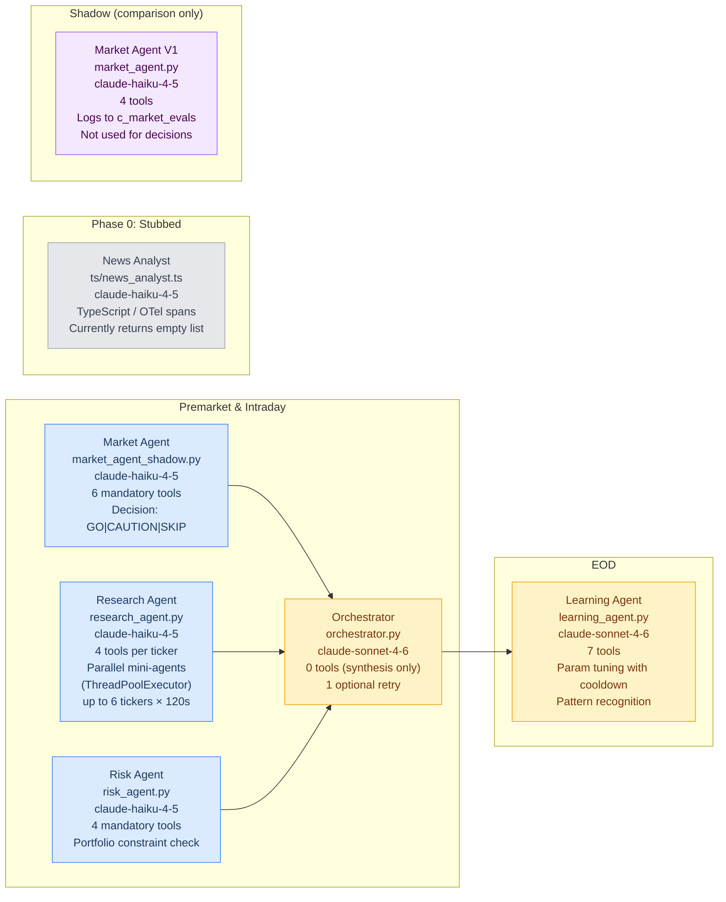

---

## Premarket Pipeline

```mermaid
flowchart TD
    GHA["GitHub Actions\n7:15 AM ET"]:::infra --> PM["sessions/premarket.main()"]

    PM --> GUARD["Pre-checks\n─────────────────\ncheck_protection_status() ← c_protection_events\nis_trading_day() ← c_agent_config\nload_params() ← c_strategy_params\n_existing_session_guard() ← c_sessions\n(skips if completed session today)"]:::filter

    GUARD --> SCANNER["scanner.run_scanner()\n─────────────────\nyfinance bars per universe\nWrites c_scan_results\n{ticker, score, price, sector}"]:::agent

    SCANNER --> MA["① Market Agent Shadow\nrun_market_agent_shadow()\n─────────────────\nModel: claude-haiku-4-5\nPre-LLM circuit breakers (Python):\n  VIX > 35 → SKIP\n  avg futures < -2% → SKIP\n  all 3 indices < -1% → SKIP\n6 tools called (all mandatory)"]:::haiku

    MA --> MAGATE{decision?}
    MAGATE -->|SKIP| HALT["Log to c_sessions\nterminal_reason=market_skip\nSend alert"]:::filter
    MAGATE -->|GO / CAUTION| PREGATE

    PREGATE["Pre-research gate\nget_candidates() ← c_scan_results\nSkip research if no candidates"]:::filter --> RA

    RA["② Research Agent\nrun_research_agent()\n─────────────────\nModel: claude-haiku-4-5\nPhase 1: deterministic screening\n  get_candidates() + get_gap_up_tickers()\n  get_premarket_snapshot()\n  Select up to 6 tickers\nPhase 2: parallel mini-agents\n  ThreadPoolExecutor\n  360s wall-clock · 120s per ticker\n  4 tools per ticker (in order)"]:::haiku

    RA --> RKA["③ Risk Agent\nrun_risk_agent()\n─────────────────\nModel: claude-haiku-4-5\n4 mandatory tools\nConstraints in order:\n  loss_limit → duplicate\n  → capital → concentration\n  → position count"]:::haiku

    RKA --> OA["④ Orchestrator\n_run_synthesis_call()\n─────────────────\nModel: claude-sonnet-4-6\nNo tools — pure synthesis\nInput: market + research + risk\nOutputs: trades[] + session_meta\nretry_needed flag"]:::sonnet

    OA --> RETRY{retry_needed\nAND not CAUTION?}
    RETRY -->|yes| RERUN["Re-run Research (if all rejected)\nor re-run Risk (if some survived)\nthen second synthesis\nloop_iteration=2"]:::filter
    RETRY -->|no| EXEC
    RERUN --> EXEC

    EXEC["⑤ _execute_trades()\n─────────────────\nOnly if now ≥ 9:30 AM ET\nElse: store in c_sessions.pending_trades\nfor intraday 9:45 AM execution"]:::agent

    EXEC --> BRACKET["submit_bracket_order()\n─────────────────\nAlpaca LimitOrderRequest\nOrderClass.BRACKET\n  entry: limit (bid-adjusted)\n  take-profit: limit leg\n  stop-loss: leg\nPolls 30s for fill\nReturns (order_id, fill_price)\nPrefix: stratc_{ticker}_{ts}"]:::infra

    BRACKET --> TRAIL["submit_trailing_stop()\n─────────────────\n_cancel_bracket_stop_leg(order_id)\nAlpaca TrailingStopOrderRequest\ntrain_percent = trail_pct × 100\nReturns trail_order_id"]:::infra

    TRAIL --> DBWRITE[("c_positions INSERT\nsession_id · ticker · entry_price\ntarget_price · stop_loss\nshares · position_size\nconfidence · entry_context\nalpaca_order_id · trail_order_id")]:::db

    DBWRITE --> MAV1["⑥ Market Agent V1 (shadow)\n─────────────────\n4 tools (subset of V2)\nResults written to c_market_evals\nFor V1 vs V2 comparison only\nDoes not affect trades"]:::shadow

    classDef agent fill:#dbeafe,stroke:#3b82f6,color:#1e3a5f
    classDef haiku fill:#dbeafe,stroke:#3b82f6,color:#1e3a5f
    classDef sonnet fill:#fef3c7,stroke:#f59e0b,color:#78350f
    classDef filter fill:#f3e8ff,stroke:#a855f7,color:#4a044e
    classDef infra fill:#dcfce7,stroke:#22c55e,color:#14532d
    classDef db fill:#fee2e2,stroke:#ef4444,color:#7f1d1d
    classDef shadow fill:#e5e7eb,stroke:#9ca3af,color:#374151
```

---

## Tools by Agent

### Market Agent Shadow — 6 Tools

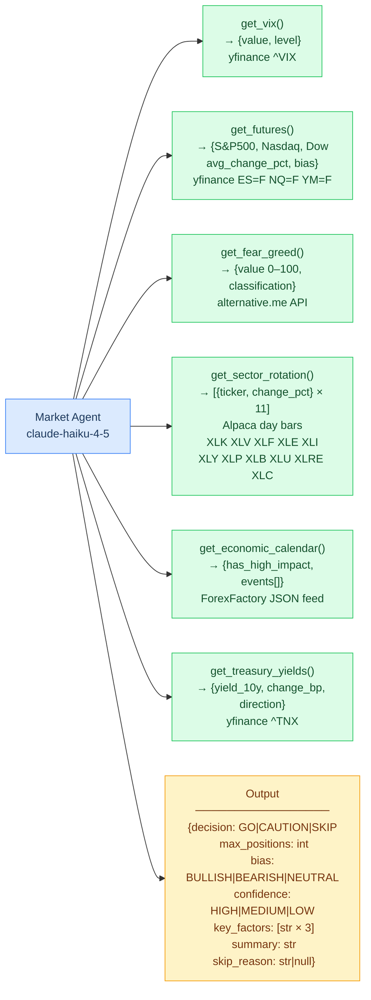

### Research Agent — 4 Tools per Ticker (Parallel)

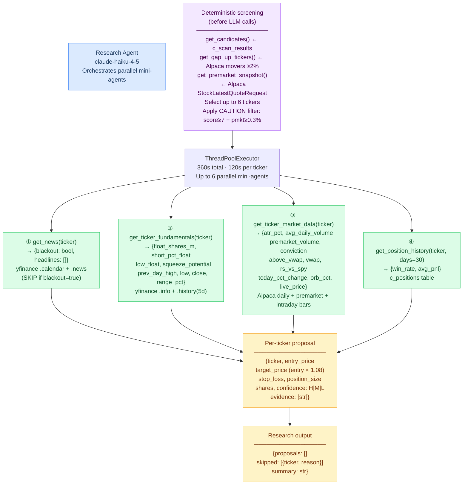

### Risk Agent — 4 Tools

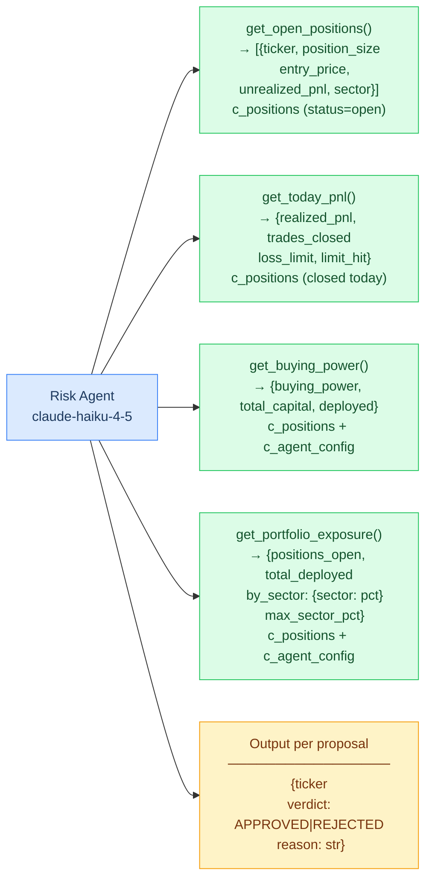

### Learning Agent — 7 Tools (EOD only)

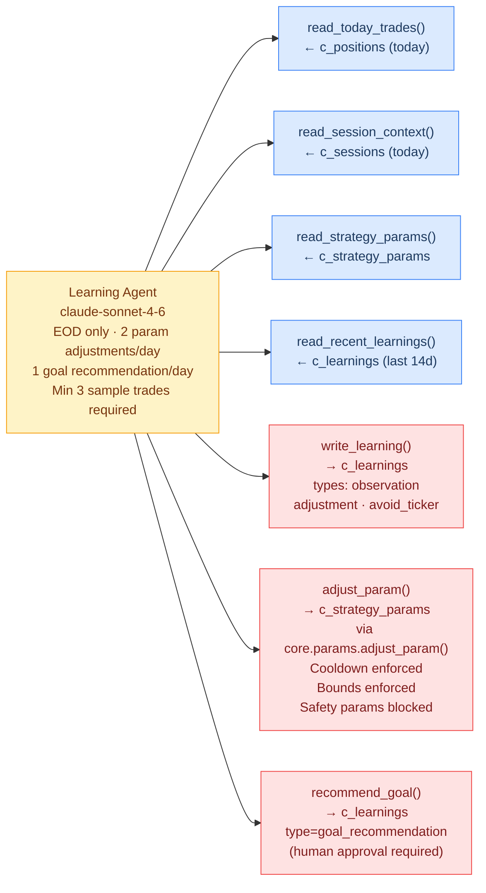

---

## Agent Handshakes — Full Sequence

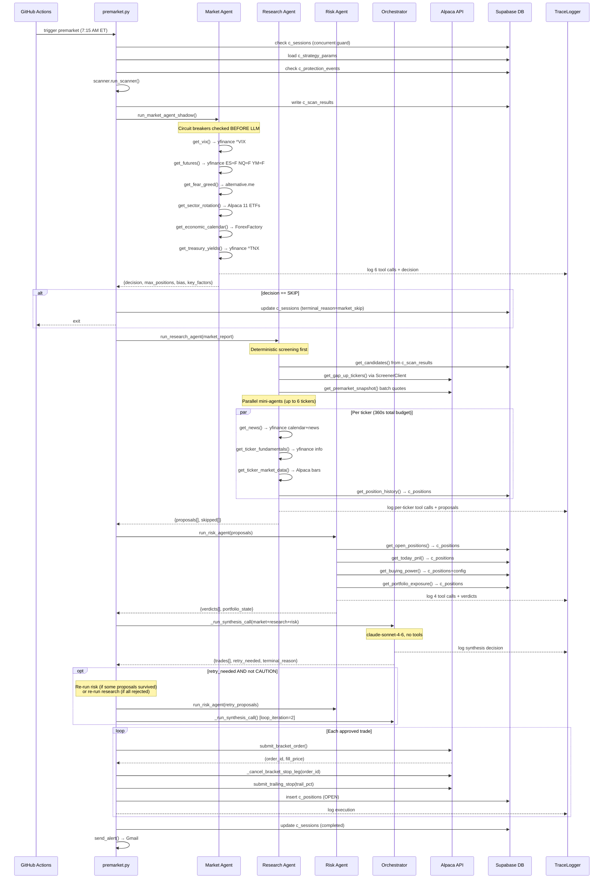

---

## Intraday Session

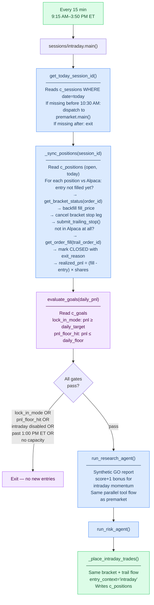

---

## EOD Session + Learning Agent

```mermaid
flowchart TD
    GHA["3:55 PM ET"]:::infra --> EOD["sessions/eod.main()"]

    EOD --> REC["reconcile_positions(session_id)\n─────────────────\nFor each open c_position:\n  get_bracket_status(order_id)\n  get_order_fill(trail_order_id)\n  Update entry_price if filled differently\n  Mark CLOSED if exit leg filled\n  Calculate realized_pnl"]:::agent

    REC --> FORCE["force_close_positions()\n─────────────────\nSnapshot unrealized_pnl via Alpaca\ncancel_all_orders() — clear brackets\nclose_all_strategy_positions()\n  (market sell, stratc_ prefix)\nDetermine realized_pnl:\n  fill_price > alpaca_snapshot > 0.0\nMark: status=closed, exit_reason=eod_forced"]:::agent

    FORCE --> PERF["compute_performance(session_id)\n─────────────────\nRead all closed c_positions for today\nCompute: realized_pnl · trades_won\n  trades_lost · win_rate\n  largest_win · largest_loss\n  avg_hold_min\nWrite c_daily_performance"]:::agent

    PERF --> PROT["check_protection_status()\n─────────────────\n6 tiers checked:\n  T2: daily_pnl ≤ -$500 → suspend\n  T3: rolling_3d ≤ -$1000 → reduce\n  T4: drawdown ≥ 10% → suspend 24h\n  T5: drawdown ≥ 20% → suspend 7d\n  T6: 5 consecutive losing days → 7d\nWrites c_protection_events (immutable)"]:::agent

    PROT --> GOALS["update_goal_progress(pnl)\nrecord_goal_snapshots(date, pnl)\nWrites c_goals · c_goal_snapshots"]:::agent

    GOALS --> LA["Learning Agent\nrun_learning_agent()\n─────────────────\nModel: claude-sonnet-4-6\n7 tools: 4 read + 3 write\nReads last 5 days + today\nMay write:\n  c_learnings (observations)\n  c_strategy_params (with cooldown)\n  c_learnings (goal recommendations\n    → require human approval)"]:::sonnet

    LA --> CLOSE["tracer.close_session()\nsend_alert() → Gmail"]:::infra

    classDef agent fill:#dbeafe,stroke:#3b82f6,color:#1e3a5f
    classDef sonnet fill:#fef3c7,stroke:#f59e0b,color:#78350f
    classDef infra fill:#dcfce7,stroke:#22c55e,color:#14532d
```

---

## Observability & Trace System

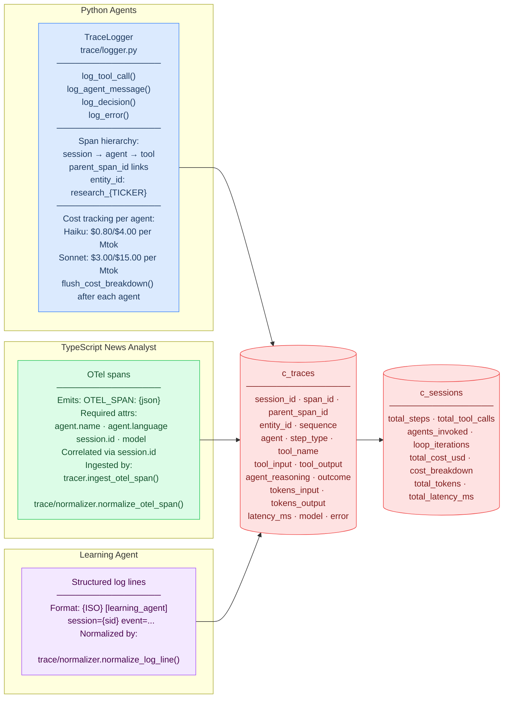

**Outcome vocabulary** (controlled, not free-text):

| Agent | Outcomes |
|---|---|
| Market | `go` · `caution` · `skip` |
| Research | `proposed` · `skipped_blackout` · `skipped_below_vwap` · `skipped_atr` · `skipped_score` · `skipped_price_moved` |
| Risk | `approved` · `rejected_loss_limit` · `rejected_capital` · `rejected_concentration` · `rejected_duplicate` · `rejected_count` |
| Orchestrator | `converged` · `retry_triggered` · `structural_block` · `time_limit` · `tool_cap` · `skip_propagated` · `caution_no_retry` |

---

## Data Model

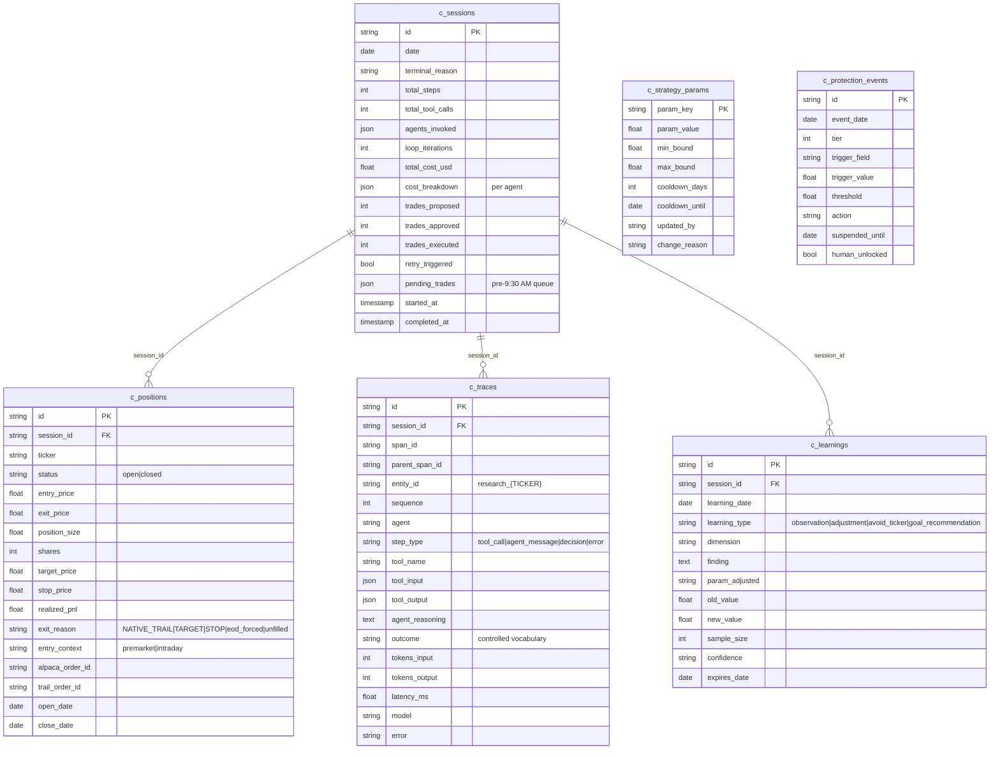

---

## Protection System

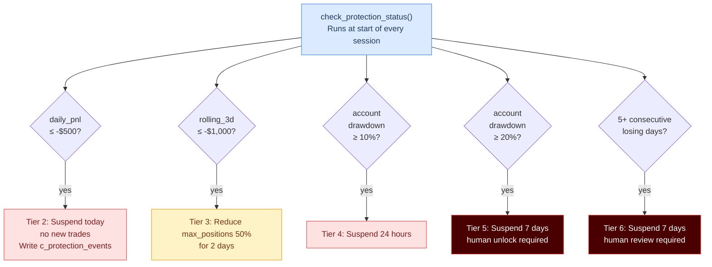

---

## External Integrations

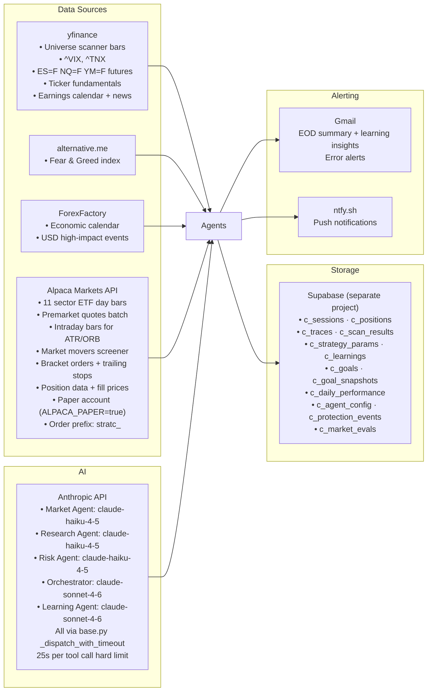

---

## Key Configuration (c_strategy_params + c_agent_config)

| Param | Default | Bounds | Adjusted by |
|---|---|---|---|
| `strategy_min_score` | 5 | 4–7 | Learning Agent |
| `max_positions` | 10 | 5–15 | Learning Agent |
| `atr_multiplier` | 0.8 | 0.5–1.5 | Learning Agent |
| `trail_pct` | 0.015 | 0.005–0.03 | Learning Agent |
| `intraday_entries` | true | bool | Human only (c_agent_config) |
| `intraday_max_new_positions` | 2 | int | Human only |
| `daily_loss_limit` | -$500 | float | Human only (safety param, blocked from Learning Agent) |
| `enable_learning_agent` | true | bool | Human only |

---

## What Makes Strategy C Different

| Dimension | Strategy A / B | Strategy C |
|---|---|---|
| Claude invocations | 1 per day | 5–8 per day (5 agents + optional retry) |
| Tool use | Agents are Python functions, no LLM tools | Each Claude agent has its own tool set; decides what to look up |
| Research | Batch scan → one Claude call | Parallel per-ticker mini-agents, each with 4 tools and individual context |
| Risk assessment | Deterministic Python rules | Risk Agent (Haiku) reasons about portfolio using 4 live DB queries |
| Synthesis | Claude selects from pre-filtered list | Orchestrator (Sonnet) synthesizes 3 agent reports, can trigger retry loop |
| Adaptive learning | Manual config changes | Learning Agent rewrites its own strategy params with cooldown protection |
| Observability | scan_results JSON blob | Full span-level trace in c_traces: every tool call, token count, latency, cost |
| Protection | Single daily loss limit | 6-tier protection system with immutable audit log |
| Pre-market timing | Order at execution | Trades queued in pending_trades if before 9:30 AM, executed at 9:45 AM by intraday |
| Account | Shared with Strategy A/B | Separate Alpaca paper account, separate Supabase project |
